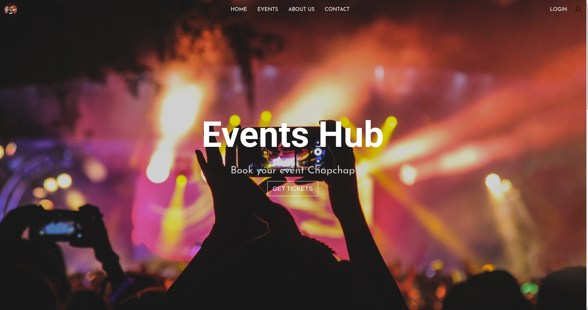

# EVENTS HUB 

## Group Members 

- [Ebenezar Bukosia](https://github.com/Ebenezr)
- [Bonface Masira](https://github.com/bonfacemasira) 
- [Maurice Nganga](https://github.com/moryno)
- [Timothy Mailu](https://github.com/Tim254)

## Screenshot
 

 ## Table of Content
 - [Figma Design](#Figma-design)
 - [Description](#description)
 - [Features](#features)
 - [Behaviour Driven Development](#Behaviour-Driven-Development)
 - [Requirements](#requirements)
 - [Installation Process](#installation-Process)
 - [Live Link](#Live-Link)
 - [Technology  Used](#technology-Used)
 - [Licence](#licence)
 - [Authors Info](#Authors-Info)
 

## Figma design
Event-Hub Design: https://www.figma.com/file/tjogjZ7ycG3cR06uHDsyAk/landingpage?node-id=0%3A1 
 
 ## Description
 
This project is a web application for an Event Company. It allows a user to view available events and book tickets to the selected events. Payment is made via M-Pesa paybill number that will be displayed on the screen on checkout. A unique account number is generated for evry event ticket booking.

## Features
As a user of the application,you will be able to :
1. See the available events on events page
2. Select an event of choice and add it to cart
3. Specify the number of tickets to buy for each event
4. Promp the user to make payment via M-Pesa using a uniques account number

## Behaviour Driven Development|
| Behaviour      | Input        | Output       |
| :------------- | :----------: | -----------: |
|  Enter your name  |   User Name |     |
| Enter your Email Address  | user.email@student.moringaschool.com |   |
| Enter your message or comment   |  I would like to inquire about something     |     |
| Press Submit|     |Pop up "User Name , we have received your message. Thank you for reaching out to us.|

 ###  Requirements
 * Access to  a computer or any other garget
 * Access to internet

 ### Installation Process
 ****
* Clone to this repo : git clone https://github.com/Ebenezr/Events-Hub
* Unzip the downloaded files in a folder of choice.
* Open the index file from the zipped file with any browser.
 ****

### Live Link
- Click this link to view the live application https://ebenezr.github.io/Events-Hub/
### Technology  Used
* HTML - which was used to develope the structure of the web application
* CSS - which was used to style the web pages
* JavaScript - which was used for adding functionality to the web page elements.

## Known Bugs
* The result button is work in progress

## Licence
MIT License
Copyright (c) [2022] [Events Hub]
Permission is hereby granted, free of charge, to any person obtaining a copy
of this software and associated documentation files (the "Software"), to deal
in the Software without restriction, including without limitation the rights
to use, copy, modify, merge, publish, distribute, sublicense, and/or sell
copies of the Software, and to permit persons to whom the Software is
furnished to do so, subject to the following conditions:
The above copyright notice and this permission notice shall be included in all
copies or substantial portions of the Software.
THE SOFTWARE IS PROVIDED "AS IS", WITHOUT WARRANTY OF ANY KIND, EXPRESS OR
IMPLIED, INCLUDING BUT NOT LIMITED TO THE WARRANTIES OF MERCHANTABILITY,
FITNESS FOR A PARTICULAR PURPOSE AND NONINFRINGEMENT. IN NO EVENT SHALL THE
AUTHORS OR COPYRIGHT HOLDERS BE LIABLE FOR ANY CLAIM, DAMAGES OR OTHER
LIABILITY, WHETHER IN AN ACTION OF CONTRACT, TORT OR OTHERWISE, ARISING FROM,
OUT OF OR IN CONNECTION WITH THE SOFTWARE OR THE USE OR OTHER DEALINGS IN THE
SOFTWARE.

## Contributors Profiles

- [Ebenezar Bukosia](https://github.com/Ebenezr)
- [Bonface Masira](https://github.com/bonfacemasira) 
- [Maurice Nganga](https://github.com/moryno)
- [Timothy Mailu](https://github.com/Tim254)